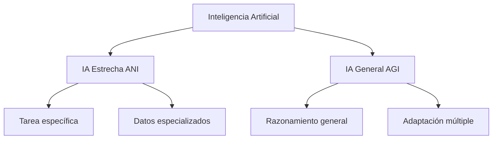
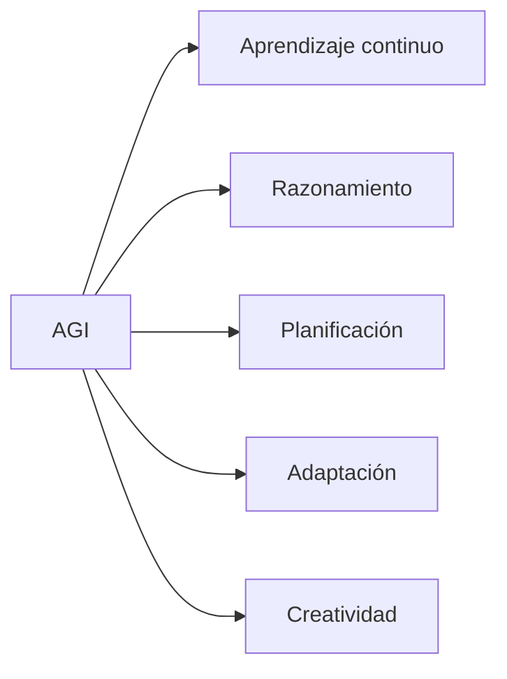
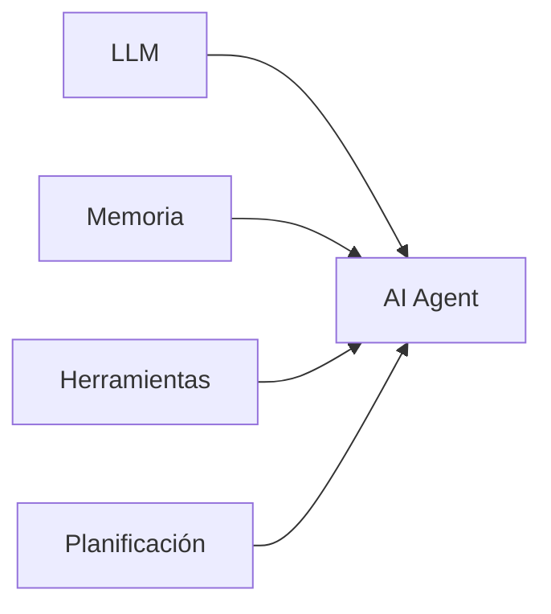

# IA Estrecha vs IA General

La clasificación más importante dentro de la Inteligencia Artificial moderna es la diferencia entre:

- [[IA Estrecha]] (ANI - Artificial Narrow Intelligence)
- [[IA General]] (AGI - Artificial General Intelligence)

Esta diferencia define el nivel de capacidad, adaptación y autonomía de un sistema inteligente.

---

# Comparación general

---

# IA Estrecha (ANI)

## Definición

La IA Estrecha es un sistema diseñado para realizar una tarea concreta.

Puede superar a los humanos dentro de un dominio específico, pero no posee inteligencia general.

Ejemplos:

- Reconocimiento facial.
- Sistemas antifraude.
- Traducción automática.
- Recomendadores.
- Diagnóstico asistido.
- Asistentes virtuales.

---

# Características de ANI

| Característica | Descripción |
|-|-|
| Especialización | Resuelve problemas concretos |
| Aprendizaje | Usa datos específicos |
| Adaptación | Limitada al dominio entrenado |
| Conciencia | No posee |
| Comprensión general | No posee |

---

# Ejemplos actuales

## Sistemas de visión

Ejemplo:

Un modelo que detecta objetos en cámaras.

Puede reconocer:

- Personas.
- Vehículos.
- Animales.

Pero no entiende el mundo como una persona.

Relacionado:

[[Deep Learning]]

---

## Modelos de lenguaje

Ejemplo:

Los actuales:

- GPT
- Llama
- Mistral
- Claude

son modelos avanzados, pero siguen siendo sistemas especializados.

Aunque pueden:

- Escribir.
- Programar.
- Analizar información.

no poseen:

- Conciencia.
- Experiencia propia.
- Comprensión humana completa.

Relacionado:

[[LLMs]]

---

# Inteligencia Artificial General (AGI)

## Definición

La Inteligencia Artificial General sería un sistema capaz de realizar cualquier tarea intelectual que pueda realizar un humano.

Una AGI debería poder:

- Aprender nuevos conocimientos.
- Transferir habilidades entre dominios.
- Resolver problemas desconocidos.
- Adaptarse a nuevos ambientes.

---

# Capacidades esperadas de una AGI

---

# Diferencias principales

| Aspecto | ANI | AGI |
|-|-|-|
| Alcance | Una tarea | Muchas tareas |
| Aprendizaje | Limitado | General |
| Adaptación | Baja | Alta |
| Transferencia conocimiento | Limitada | Amplia |
| Existencia actual | Sí | No confirmada |

---

# ¿ChatGPT es AGI?

No.

Los modelos actuales de lenguaje son sistemas extremadamente avanzados de IA Estrecha.

Pueden simular:

- Conversación.
- Razonamiento.
- Programación.
- Análisis.

Pero todavía presentan limitaciones:

- Dependencia de entrenamiento previo.
- Errores de razonamiento.
- Falta de experiencia física.
- Falta de autonomía completa.

Relacionado:

[[LLMs]]

[[AI Agents]]

---

# Camino hacia sistemas agénticos

La evolución actual busca combinar:

Los agentes modernos agregan:

- Uso de herramientas.
- Memoria.
- Objetivos.
- Ejecución de acciones.

Relacionado:

[[AI Agents]]

---

# Debate actual

La comunidad científica debate:

## Posición 1

Los LLM actuales son un paso hacia AGI.

Argumentos:

- Mayor escala.
- Mejor razonamiento.
- Uso de herramientas.
- Capacidades emergentes.

---

## Posición 2

Los LLM no son AGI.

Argumentos:

- Predicen texto.
- No tienen comprensión humana.
- No tienen experiencia del mundo.
- No tienen autonomía real.

---

# Laboratorio práctico

## Clasificar sistemas

Determina si son ANI o AGI:

| Sistema | Clasificación |
|-|-|
| Alexa | ? |
| Tesla Autopilot | ? |
| Robot doméstico universal | ? |
| Modelo que aprende cualquier tarea | ? |
| Sistema experto médico | ? |

---

# Preguntas de evaluación

1. ¿Qué significa ANI?
2. ¿Por qué los sistemas actuales son considerados IA estrecha?
3. ¿Qué capacidades diferenciarían una AGI?
4. ¿Qué elementos necesitan los agentes para aumentar su autonomía?

---

# Conceptos relacionados

- [[Que es Inteligencia Artificial]]
- [[Historia de la IA]]
- [[Tipos de IA]]
- [[Machine Learning]]
- [[Deep Learning]]
- [[LLMs]]
- [[AI Agents]]
- [[Seguridad de IA]]

---

# Referencias

- Elements of AI
- Stanford AI courses
- DeepLearning.AI
- Hugging Face Course