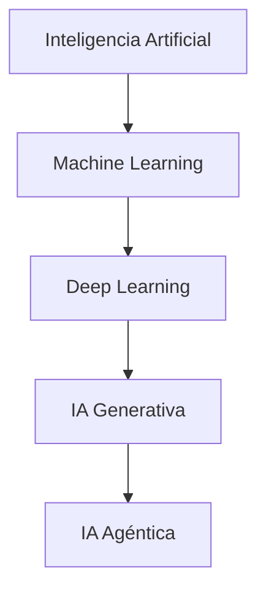

# ¿Qué es Inteligencia Artificial?

## Objetivo

Comprender qué es la Inteligencia Artificial, cómo funciona a nivel conceptual y cómo se relaciona con Machine Learning, Deep Learning, LLMs e IA Agéntica.

---

# Definición

La Inteligencia Artificial (IA) es una rama de la informática que busca crear sistemas capaces de realizar tareas que normalmente requieren inteligencia humana.

Estas tareas incluyen:

- Percepción.
- Aprendizaje.
- Razonamiento.
- Toma de decisiones.
- Comprensión del lenguaje.
- Generación de contenido.
- Resolución de problemas.

---

# Evolución de la IA

---

# Tipos de capacidades de IA

## Percepción

Capacidad de interpretar información del mundo.

Ejemplos:

- Visión artificial.
- Reconocimiento facial.
- Audio.
- Sensores.

Relacionado:

- [[Deep Learning]]

---

## Aprendizaje

Capacidad de mejorar mediante datos.

Relacionado:

- [[Machine Learning]]

---

## Razonamiento

Capacidad de analizar información y tomar decisiones.

Ejemplos:

- Sistemas expertos.
- Modelos de lenguaje.
- Agentes inteligentes.

Relacionado:

- [[AI Agents]]

---

## Generación

Capacidad de crear contenido nuevo.

Ejemplos:

- Texto.
- Imágenes.
- Audio.
- Video.
- Código.

Relacionado:

- [[LLMs]]
- [[IA Generativa]]

---

# IA tradicional vs IA moderna

| IA tradicional | IA moderna |
|-|-|
| Reglas programadas | Aprende de datos |
| Sistemas expertos | Redes neuronales |
| Lógica fija | Modelos adaptativos |
| Datos estructurados | Datos masivos |

---

# Ejemplos actuales

## Asistentes inteligentes

- ChatGPT
- Claude
- Gemini

## Automatización

- Agentes empresariales.
- Procesamiento documental.
- Análisis de datos.

## Ingeniería

- Generación de código.
- Diagnóstico.
- Simulación.

---

# Relación con IA Agéntica

La IA Agéntica representa una evolución donde un sistema puede:

1. Recibir un objetivo.
2. Planificar acciones.
3. Usar herramientas.
4. Consultar información.
5. Ejecutar tareas.
6. Evaluar resultados.

Relacionado:

- [[AI Agents]]
- [[Function Calling]]
- [[MCP]]

---

# Recursos

## Cursos

- DeepLearning.AI - AI for Everyone
- Microsoft Learn AI Fundamentals

## Documentación

- OpenAI Documentation
- Hugging Face Course

---

# Siguiente tema

[[Historia de la IA]]