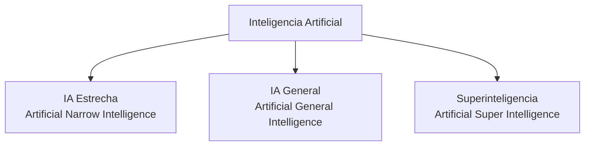
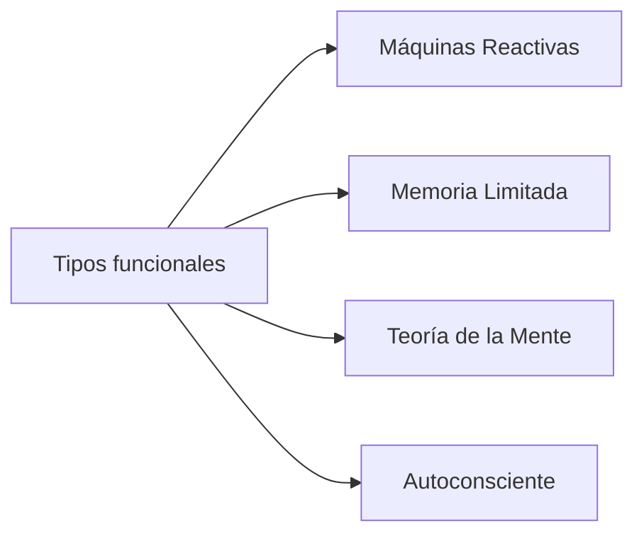
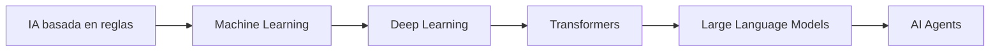

# Tipos de Inteligencia Artificial

La Inteligencia Artificial puede clasificarse según diferentes criterios:

- Capacidad del sistema.
- Forma de aprendizaje.
- Nivel de autonomía.
- Arquitectura utilizada.

Esta clasificación permite entender la evolución desde sistemas simples basados en reglas hasta sistemas modernos basados en [[LLMs]] y [[AI Agents]].

---

# Clasificación por capacidad

---

# 1. IA Estrecha (ANI)

También llamada:

- Narrow AI
- Weak AI
- Inteligencia Artificial Débil

Es la inteligencia artificial especializada en una tarea específica.

Ejemplos:

- Reconocimiento facial.
- Sistemas de recomendación.
- Asistentes virtuales.
- Detección de fraude.
- Traducción automática.

Características:

- Excelente desempeño en un dominio concreto.
- No posee comprensión general.
- No puede transferir conocimiento libremente entre áreas.

Ejemplos actuales:

- Modelos de visión artificial.
- Chatbots.
- Sistemas de recomendación.
- Modelos de lenguaje actuales.

Relacionado:

[[IA Estrecha vs IA General]]

---

# 2. Inteligencia Artificial General (AGI)

También conocida como:

- Artificial General Intelligence.
- IA fuerte.

Sería una inteligencia capaz de:

- Aprender cualquier tarea intelectual.
- Comprender diferentes dominios.
- Adaptarse a situaciones nuevas.
- Resolver problemas desconocidos.

Una AGI tendría capacidades similares o superiores a las humanas en múltiples áreas.

Actualmente:

> La AGI todavía no existe como tecnología demostrada.

---

# 3. Superinteligencia Artificial (ASI)

Concepto hipotético donde una inteligencia artificial supera ampliamente las capacidades humanas.

Podría superar a humanos en:

- Investigación científica.
- Estrategia.
- Creatividad.
- Resolución de problemas.

Es un tema importante dentro de:

[[Seguridad de IA]]

y

[[Alineamiento de IA]]

---

# Clasificación por funcionamiento

---

# Máquinas Reactivas

Primer tipo histórico de IA.

Características:

- No almacenan experiencias.
- Responden únicamente al estado actual.

Ejemplo:

Sistemas expertos antiguos.

---

# Memoria Limitada

Sistemas capaces de utilizar datos históricos.

Ejemplos:

- Vehículos autónomos.
- Sistemas predictivos.
- Modelos Machine Learning.

Los modelos modernos como los [[LLMs]] utilizan grandes cantidades de información durante su entrenamiento, aunque no poseen memoria humana permanente.

---

# Teoría de la Mente

Área de investigación futura.

Busca sistemas capaces de comprender:

- Intenciones humanas.
- Emociones.
- Contexto social.

---

# IA Autoconsciente

Concepto teórico.

Implica una IA con:

- Conciencia.
- Autopercepción.
- Experiencia subjetiva.

Actualmente no existe.

---

# Relación con la IA Moderna

La evolución actual puede verse así:

---

# Laboratorio práctico

## Identificar sistemas IA

Clasifica estos sistemas:

| Sistema | Tipo |
|-|-|
| Netflix recomendaciones | ? |
| ChatGPT | ? |
| Detector de spam | ? |
| Vehículo autónomo | ? |
| Robot humanoide futuro | ? |

Objetivo:

Relacionar aplicaciones reales con los conceptos aprendidos.

---

# Preguntas de evaluación

1. ¿Cuál es la diferencia entre ANI y AGI?
2. ¿Por qué los LLM actuales se consideran IA estrecha?
3. ¿Qué características tendría una AGI?
4. ¿Qué riesgos plantea una ASI?

---

# Conceptos relacionados

- [[Que es Inteligencia Artificial]]
- [[Historia de la IA]]
- [[IA Estrecha vs IA General]]
- [[Machine Learning]]
- [[Deep Learning]]
- [[Transformers]]
- [[LLMs]]
- [[AI Agents]]

---

# Referencias

- Elements of AI
- Stanford Machine Learning
- DeepLearning.AI
- Hugging Face Course
- Documentación de modelos de IA abiertos