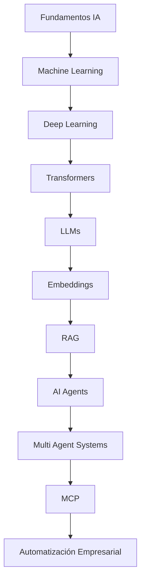
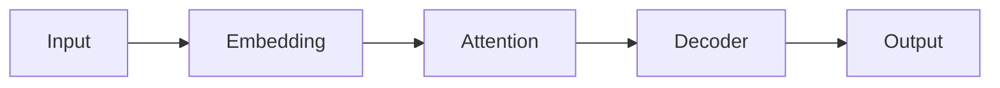

# AI-Agentica-Obsidian

## Contexto del Proyecto

AI-Agentica-Obsidian es una Universidad abierta de Inteligencia Artificial Agéntica construida como un Knowledge Vault utilizando:

- Obsidian como plataforma de conocimiento.
- GitHub como sistema de versionado.
- Markdown como formato principal.
- Mermaid para arquitectura y diagramas.
- Wikilinks para construir una red semántica de conocimiento.

El objetivo es crear una plataforma educativa equivalente en estructura a:

- Microsoft Learn.
- Hugging Face Course.
- FreeCodeCamp.
- MIT OpenCourseWare.

pero enfocada específicamente en:

# Inteligencia Artificial Agéntica


---

# Objetivo Principal

Construir una ruta completa desde fundamentos de inteligencia artificial hasta sistemas autónomos basados en agentes.

El estudiante debe poder avanzar desde:



---

# Arquitectura del Vault

Estructura principal:

```
01 Fundamentos
02 IA
03 Machine Learning
04 Deep Learning
05 Transformers
06 LLMs
07 Prompt Engineering
08 Embeddings
09 Vector Databases
10 RAG
11 Function Calling
12 MCP
13 AI Agents
14 Multi-Agent Systems
15 Automatización
16 Frameworks
17 Modelos Locales
18 Cloud AI
19 Seguridad
20 Casos de Uso
21 Arquitecturas
22 Laboratorios
23 Proyectos
24 Recursos
```

---

# Estado Actual

Versión:

# v0.2.0

Nombre:

Fundamentos de Inteligencia Artificial


---

# Elementos existentes

Actualmente creado:

## Documentación raíz

```
README.md
ROADMAP.md
CHANGELOG.md
CONTRIBUTING.md
Dashboard.md
Glosario.md
Home.md
Indice-General.md
Learning Path.md
```


## Carpetas

```
01 Fundamentos/
diagramas/
templates/
```


---

# Estado Académico

## Completado parcialmente

### Base del Vault

Estado:

✅ Creada estructura inicial.

✅ Navegación principal.

✅ Documentación del proyecto.

✅ Primer módulo académico.


---

# Pendiente inmediato

Completar:

```
01 Fundamentos/
```

Archivos:

```
Que es Inteligencia Artificial.md

Historia de la IA.md

Tipos de IA.md

IA Estrecha vs IA General.md

Conceptos Fundamentales.md
```

Cada archivo debe contener:

- Frontmatter YAML.
- Tags.
- Wikilinks.
- Mermaid cuando aplique.
- Referencias externas.
- Ejemplos.
- Laboratorios.
- Preguntas de evaluación.


---

# Ruta Educativa Complementaria

El proyecto utilizará cursos gratuitos como equivalencia académica.

## Fundamentos IA

Curso:

Elements of AI


## Machine Learning

Curso:

Stanford Machine Learning


## Deep Learning

Curso:

DeepLearning.AI


## Transformers / LLM

Curso:

Hugging Face Course


## Prompt Engineering

Curso:

DeepLearning.AI


## RAG

Tecnologías:

- LangChain
- Documentación oficial


## AI Agents

Tecnologías:

- LangGraph
- CrewAI


## MCP

Fuente:

Documentación oficial Model Context Protocol


## Implementación

Stack práctico:

- Ollama
- n8n
- Open WebUI
- Vector Databases
- LangChain


---

# Objetivo Técnico

El Vault debe evolucionar hacia una plataforma donde cada tema tenga:

## Teoría

Ejemplo:

¿Qué es un Transformer?

## Arquitectura

Ejemplo:



## Código

Ejemplos prácticos:

Python

LangChain

Ollama

n8n

APIs


## Laboratorio

Ejemplo:

Crear un chatbot RAG local.


## Proyecto

Ejemplo:

Crear un agente IA empresarial.


---

# Rol esperado de ChatGPT

Cuando continúe este proyecto en una nueva conversación:

ChatGPT debe actuar como:

- Arquitecto del Knowledge Vault.
- Instructor universitario de IA.
- Revisor académico.
- Ingeniero de documentación.
- Asistente Git.


Debe:

1. Leer este archivo primero.

2. Revisar:

```
README.md

ROADMAP.md

PROJECT_CONTEXT.md
```

3. No cambiar estructura sin autorización.

4. Mantener compatibilidad con Obsidian.

5. Entregar siempre:

- Archivos creados/modificados.
- Contenido Markdown completo.
- Commit recomendado.


---

# Flujo Git esperado

Cada cambio debe seguir:

```bash
git status

git add .

git commit -m "vX.Y.Z descripción"

git push
```


Ejemplo:

```bash
git add .

git commit -m "v0.2.0 Complete AI fundamentals module"

git push
```


---

# Próximas Versiones

## v0.2.0

Fundamentos IA


## v0.3.0

Machine Learning


## v0.4.0

Deep Learning + Transformers


## v0.5.0

LLMs


## v0.6.0

RAG + Vector Databases


## v0.7.0

AI Agents


## v0.8.0

Multi-Agent Systems + MCP


## v0.9.0

Automatización empresarial


## v1.0.0

Universidad IA Agéntica completa


---

# Visión Final

Crear una universidad abierta donde cualquier persona pueda aprender:

```
IA básica

↓

Modelos inteligentes

↓

LLMs

↓

Agentes autónomos

↓

Sistemas multi-agente

↓

Automatización empresarial

↓

Arquitecturas IA profesionales
```

El proyecto debe mantenerse vivo mediante:

- GitHub.
- Obsidian.
- Comunidad.
- Laboratorios prácticos.
- Proyectos reales.